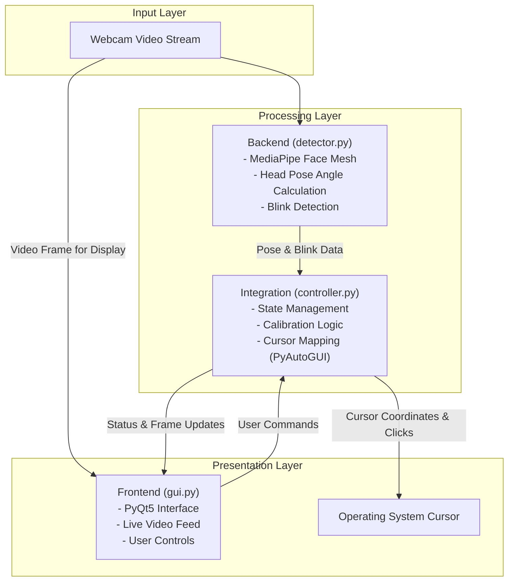

# Hands-Free Desktop Control: A Human-Computer Interaction System

**A Graduation Project - Eastern Mediterranean University**

**Authors:**
- Berkin Kaynar
- Cıvan Deniz Doğan
- Orçun Altınel

**Supervisor:**
- Assoc. Prof. Dr. Adnan Acan

---

## 1. Abstract

This project presents a real-time, vision-based human-computer interaction (HCI) system designed to provide hands-free control of a desktop environment. The primary objective is to offer an alternative input modality for users with physical disabilities that limit their use of conventional peripherals like a mouse and keyboard. The system leverages a standard webcam to capture the user's video stream, applying computer vision techniques to track head orientation for cursor navigation and to detect eye blinks for click actuation. The core of the system is built on the MediaPipe framework for robust facial landmark detection, OpenCV for image processing, and PyAutoGUI for OS-level automation. The user interface is implemented using PyQt5, providing essential controls and visual feedback. This document outlines the system's architecture, technical implementation, and usage instructions.

## 2. System Architecture

The application is designed with a modular, three-layer architecture to separate concerns between data input, processing logic, and user presentation.



-   **Input Layer**: Consists of the webcam, which provides the raw video feed.
-   **Processing Layer**: This is the core of the system.
    -   The **Backend** (`detector.py`) processes each frame to identify facial landmarks, calculate the 3D head pose (yaw, pitch, roll), and detect blinks.
    -   The **Integration** (`controller.py`) layer receives this data, calibrates the user's neutral "center" position, and translates head movements and blinks into corresponding cursor commands via `PyAutoGUI`.
-   **Presentation Layer**:
    -   The **Frontend** (`gui.py`) offers a user-friendly interface to start/stop the controls, and view the live video feed.
    -   The **Operating System Cursor** is the final output, moving and clicking as directed by the processing layer.

## 3. Core Features

-   **Head Pose Tracking**: The system calculates the head's Euler angles (yaw and pitch) in real-time. These angles are mapped to the screen's X and Y coordinates to control the cursor's position. A smoothing filter and a configurable dead zone are applied to enhance stability and prevent jitter.
-   **Blink Detection**: Eye blinks are used as the primary mechanism for click actions. The system analyzes the vertical distance between pupil landmarks to register single and double clicks. It distinguishes between left-eye and right-eye blinks to trigger different actions (e.g., left-click vs. right-click).
-   **Calibration**: A calibration function allows the user to set their current head position as the neutral "center" point. All subsequent movements are then measured relative to this calibrated origin, allowing for flexible user posture.
-   **Graphical User Interface (GUI)**: A clean and modern interface provides controls to start and stop tracking, initiate calibration, and adjust cursor sensitivity. It also displays the live webcam feed for immediate visual feedback.

## 4. Technology Stack

-   **Programming Language**: Python 3.9+
-   **Computer Vision**: OpenCV, MediaPipe
-   **GUI Framework**: PyQt5
-   **OS Automation**: PyAutoGUI
-   **Packaging & Testing**: Setuptools, PyInstaller, PyTest

## 5. Setup and Installation (For Developers)

Follow these steps to set up a local development environment.

**1. Clone the Repository**
```bash
git clone https://github.com/berkinksk/handsfree-desktop-control.git
cd handsfree-desktop-control
```

**2. Create a Virtual Environment**
It is highly recommended to use a virtual environment to manage project dependencies.
```bash
# For Windows
python -m venv .venv
.venv\Scripts\activate

# For macOS/Linux
python -m venv .venv
source .venv/bin/activate
```

**3. Install Dependencies**
The project is packaged with `setup.py`. Installing it in editable mode (`-e`) will install all required packages and ensure the `src` directory is in the Python path.
```bash
pip install -e .
```

## 6. Usage

Once the setup is complete, the application can be launched from the root directory:
```bash
python app.py
```

## 7. Building from Source

To create a standalone executable (`.exe` on Windows), `PyInstaller` is used. Ensure all dependencies are installed, then run the following command from the project root:

```bash
pyinstaller --onefile --windowed --name "HandsfreeDesktopControl" ^
--icon=src/frontend/assets/sun.png ^
--add-data ".venv/Lib/site-packages/mediapipe;mediapipe" ^
--add-data "src/frontend/assets;assets" ^
app.py
```
*Note: The path to `mediapipe` within the virtual environment (`.venv`) may vary slightly based on OS and Python version.*

The final executable will be located in the `dist/` directory.

## 8. Repository Structure

The source code is organized as follows:

-   `app.py`: The main entry point for the application.
-   `setup.py`: The packaging and installation script.
-   `src/`: Contains the core source code.
    -   `backend/`: Modules for computer vision tasks (e.g., `detector.py`).
    -   `frontend/`: The PyQt5 GUI code (`gui.py`) and associated assets.
    -   `integration/`: The controller logic that connects the backend to the frontend (`controller.py`).
-   `tests/`: Contains unit and integration tests for the project.
-   `requirements.txt`: A list of all Python dependencies.

## 9. License

This project is distributed under the MIT License. Please see the `LICENSE` file for more details.
